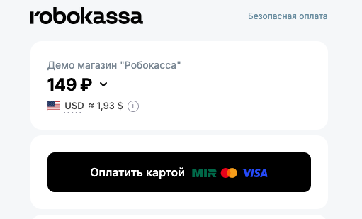

# Robokassa SDK для Go

Go SDK для интеграции с Robokassa: создание платежей, построение платежных
ссылок, проверка уведомлений, работа с XML API, счетами и фискальными чеками.



## Возможности

- создание платежной ссылки через Invoice JWT API;
- создание платежной ссылки через form flow;
- локальная сборка redirect URL без HTTP-запроса;
- проверка подписей `ResultURL` и `SuccessURL`;
- получение способов оплаты, валют и статуса операций через XML API;
- получение списка счетов через Invoice API;
- отправка второго чека и проверка его статуса.

## Установка

```bash
go get github.com/robokassa/sdk-go-main
```

```go
import robokassa "github.com/robokassa/sdk-go-main"
```

## Быстрый старт

```go
package main

import (
	"context"
	"fmt"
	"log"
	"time"

	robokassa "github.com/robokassa/sdk-go-main"
)

func main() {
	client, err := robokassa.NewClient(robokassa.Config{
		Login:       "merchant_login",
		Password1:   "password1",
		Password2:   "password2",
		HashType:    "md5",
		HTTPTimeout: 15 * time.Second,
	})
	if err != nil {
		log.Fatal(err)
	}

	paymentURL, err := client.Payment().SendJWT(context.Background(), robokassa.CreateInvoiceRequest{
		InvID:       1001,
		OutSum:      99.90,
		Description: "Order #1001",
		Culture:     "ru",
		InvoiceItems: []robokassa.InvoiceItem{
			{
				Name:          "Order #1001",
				Quantity:      1,
				Cost:          99.90,
				Tax:           "none",
				PaymentMethod: "full_payment",
				PaymentObject: "service",
			},
		},
	})
	if err != nil {
		log.Fatal(err)
	}

	fmt.Println(paymentURL)
}
```

`InvID` должен быть уникальным для нового счета.

## Какой метод выбрать

| Метод | Когда использовать | Документация Robokassa |
| --- | --- | --- |
| `Payment().SendJWT` | Нужно создать счет через API и получить готовый URL оплаты | [Invoice API](https://docs.robokassa.ru/ru/invoice-api) |
| `Payment().SendForm` | Нужно отправить form-запрос в Robokassa и получить URL счета | [Интерфейс оплаты](https://docs.robokassa.ru/ru/pay-interface) |
| `Payment().BuildPaymentURL` | Нужно локально собрать redirect URL без HTTP-запроса | [Интерфейс оплаты](https://docs.robokassa.ru/ru/pay-interface) |
| `Notification().ResultURLHandler` | Нужно принять серверное уведомление об оплате | [ResultURL](https://docs.robokassa.ru/ru/notifications-and-redirects#оповещение-об-оплате-на-resulturl) |

Для большинства новых интеграций удобнее начинать с `SendJWT`. Если нужен
классический redirect на платежную страницу без предварительного API-запроса,
используйте `BuildPaymentURL`.

Важно: тестовый режим Robokassa через `IsTest=1` применяется к классическому
платежному интерфейсу (`SendForm` и `BuildPaymentURL`), но не работает для
Invoice JWT API (`SendJWT`).

## Конфигурация

```go
client, err := robokassa.NewClient(robokassa.Config{
	Login:     os.Getenv("ROBOKASSA_LOGIN"),
	Password1: os.Getenv("ROBOKASSA_PASSWORD1"),
	Password2: os.Getenv("ROBOKASSA_PASSWORD2"),
	HashType:  "md5",
})
```

Основные поля:

- `Login` - идентификатор магазина;
- `Password1` - пароль #1, используется для создания платежей и проверки `SuccessURL`;
- `Password2` - пароль #2, используется для проверки `ResultURL` и XML API;
- `TestPassword1`, `TestPassword2` - тестовые пароли;
- `IsTest` - включает тестовый режим для платежной формы;
- `HashType` - алгоритм подписи: `md5`, `sha256` или `sha512`;
- `HTTPTimeout` - таймаут HTTP-клиента.

Можно передать собственный `http.Client`:

```go
client, err := robokassa.NewClient(cfg, robokassa.WithHTTPClient(&http.Client{
	Timeout: 10 * time.Second,
}))
```

## Переменные окружения

SDK не читает `.env` автоматически. Он получает значения из `os.Getenv`, а
загрузка файла окружения остается ответственностью приложения.

Пример `.env`:

```env
ROBOKASSA_LOGIN=your_login
ROBOKASSA_PASSWORD1=your_password1
ROBOKASSA_PASSWORD2=your_password2
ROBOKASSA_TEST_PASSWORD1=your_test_password1
ROBOKASSA_TEST_PASSWORD2=your_test_password2
ROBOKASSA_HASH_TYPE=md5
ROBOKASSA_IS_TEST=1
```

Перед запуском примеров в macOS/Linux:

```bash
set -a
source .env
set +a
```

Для PowerShell:

```powershell
$env:ROBOKASSA_LOGIN="your_login"
$env:ROBOKASSA_PASSWORD1="your_password1"
$env:ROBOKASSA_PASSWORD2="your_password2"
$env:ROBOKASSA_HASH_TYPE="md5"
$env:ROBOKASSA_IS_TEST="1"
$env:ROBOKASSA_TEST_PASSWORD1="your_test_password1"
$env:ROBOKASSA_TEST_PASSWORD2="your_test_password2"
```

Шаблон есть в [`.env.example`](.env.example).

## Тестовый режим

```go
client, err := robokassa.NewClient(robokassa.Config{
	Login:         os.Getenv("ROBOKASSA_LOGIN"),
	Password1:     os.Getenv("ROBOKASSA_PASSWORD1"),
	Password2:     os.Getenv("ROBOKASSA_PASSWORD2"),
	TestPassword1: os.Getenv("ROBOKASSA_TEST_PASSWORD1"),
	TestPassword2: os.Getenv("ROBOKASSA_TEST_PASSWORD2"),
	IsTest:        true,
	HashType:      "md5",
})
```

В тестовом режиме SDK использует `TestPassword1` и `TestPassword2` для подписи.
Этот режим относится к классическому платежному интерфейсу Robokassa:
`SendForm` и `BuildPaymentURL`. Для `SendJWT` параметр `IsTest` не включает
тестовый режим Invoice JWT API.

## Создание платежей

### Invoice JWT API

`SendJWT` не поддерживает тестовый режим через `IsTest=1`. Для тестовой проверки
используйте реальные настройки магазина или классический платежный интерфейс
`SendForm` / `BuildPaymentURL` с `IsTest: true`.

```go
paymentURL, err := client.Payment().SendJWT(ctx, robokassa.CreateInvoiceRequest{
	InvID:       1001,
	OutSum:      99.90,
	Description: "Order #1001",
	Culture:     "ru",
	InvoiceItems: []robokassa.InvoiceItem{
		{
			Name:          "Order #1001",
			Quantity:      1,
			Cost:          99.90,
			Tax:           "none",
			PaymentMethod: "full_payment",
			PaymentObject: "service",
		},
	},
})
```

### Form flow

```go
paymentURL, err := client.Payment().SendForm(ctx, robokassa.CreatePaymentRequest{
	OutSum:      "99.90",
	InvID:       "1002",
	Description: "Order #1002",
	Culture:     "ru",
	Email:       "customer@example.com",
	Receipt: robokassa.Receipt{
		Items: []robokassa.ReceiptItem{
			{
				Name:          "Order #1002",
				Quantity:      1,
				Sum:           99.90,
				Tax:           "none",
				PaymentMethod: "full_payment",
				PaymentObject: "service",
			},
		},
	},
	ShpFields: map[string]string{
		"Shp_order": "1002",
	},
})
```

### Локальная платежная ссылка

```go
paymentURL, err := client.Payment().BuildPaymentURL(robokassa.CreatePaymentRequest{
	OutSum:      "149.00",
	InvID:       "1003",
	Description: "Order #1003",
	Culture:     "ru",
	Email:       "customer@example.com",
	Receipt: robokassa.Receipt{
		Items: []robokassa.ReceiptItem{
			{
				Name:          "Order #1003",
				Quantity:      1,
				Sum:           149.00,
				Tax:           "none",
				PaymentMethod: "full_payment",
				PaymentObject: "service",
			},
		},
	},
})
```

SDK сам собирает `SignatureValue`, сохраняет порядок параметров для Robokassa и
корректно кодирует `Receipt`.

## Уведомления Robokassa

`ResultURL` - серверное уведомление от Robokassa. Используйте его как источник
истины о платеже: проверяйте подпись, сверяйте сумму и номер заказа, обновляйте
заказ идемпотентно и возвращайте `OK{InvId}`.

```go
http.Handle("/robokassa/result", client.Notification().ResultURLHandler(func(w http.ResponseWriter, r *http.Request, notification robokassa.ResultNotification) error {
	// Здесь нужно найти заказ в вашей базе и сверить:
	// notification.InvoiceID, notification.OutSum и notification.ShpFields.
	// Если callback возвращает nil, SDK сам ответит Robokassa: OK{InvId}.
	return nil
}))
```

Для локальной проверки endpoint:

```bash
go run ./examples/result-url-check
```

Robokassa должна видеть публичный URL. Для локальной машины используйте туннель,
например `ngrok http 8080`, и укажите в кабинете Robokassa адрес вида
`https://example.ngrok-free.app/result`.

`SuccessURL` приходит через браузер покупателя. Его можно проверять для UX, но
нельзя использовать как единственный источник подтверждения оплаты.

```go
err := client.Notification().VerifySuccessURL(robokassa.SuccessNotification{
	OutSum:         r.FormValue("OutSum"),
	InvoiceID:      r.FormValue("InvId"),
	SignatureValue: r.FormValue("SignatureValue"),
})
```

## Дополнительные сервисы

### XML API

```go
methods, err := client.WebService().GetPaymentMethods(ctx, "ru")
currencies, err := client.WebService().GetCurrencies(ctx, "ru")
state, err := client.WebService().OpState(ctx, 1001)
```

### Список счетов

```go
invoices, err := client.Status().GetInvoiceInformationList(ctx, robokassa.InvoiceInformationListRequest{
	CurrentPage:     1,
	PageSize:        20,
	InvoiceStatuses: []string{"Paid", "Notpaid"},
	DateFrom:        "2026-01-01T00:00:00",
	DateTo:          "2026-01-31T23:59:59",
	InvoiceTypes:    []string{"OneTime"},
})
```

### Фискальные чеки

```go
token, err := client.Receipt().BuildSecondCheckToken(robokassa.SecondCheckRequest{
	"merchantId": "your_merchant_id",
	"id":         "receipt_id",
})
```

## Обработка ошибок

Методы SDK возвращают обычный `error`. Для сетевых и API-ошибок используется
`*robokassa.SDKError`, где доступны операция, HTTP status и сообщение Robokassa.

```go
paymentURL, err := client.Payment().SendJWT(ctx, req)
if err != nil {
	var sdkErr *robokassa.SDKError
	if errors.As(err, &sdkErr) {
		log.Printf("robokassa op=%s status=%d message=%s", sdkErr.Op, sdkErr.StatusCode, sdkErr.Message)
		return
	}
	log.Println(err)
	return
}
```

## Примеры

Примеры находятся в [examples](examples).

```bash
go run ./examples/build-payment-url
go run ./examples/send-payment-jwt
go run ./examples/send-payment-form
go run ./examples/result-url-check
go run ./examples/get-payment-methods
go run ./examples/get-currencies
go run ./examples/get-invoice-status
go run ./examples/get-invoice-information
go run ./examples/send-second-check
go run ./examples/get-check-status
```

Перед запуском примеров убедитесь, что переменные окружения загружены в текущую
shell-сессию.

## Ссылки на документацию Robokassa

| SDK | Документация Robokassa |
| --- | --- |
| `Payment().BuildPaymentURL` | [Интерфейс оплаты](https://docs.robokassa.ru/ru/pay-interface), [SignatureValue](https://docs.robokassa.ru/ru/pay-interface#сборка-подписи-signaturevalue) |
| `Payment().SendForm` | [Интерфейс оплаты](https://docs.robokassa.ru/ru/pay-interface) |
| `Payment().SendJWT` | [API выставления счетов](https://docs.robokassa.ru/ru/invoice-api) |
| `Notification().ResultURLHandler` | [Оповещение на ResultURL](https://docs.robokassa.ru/ru/notifications-and-redirects#оповещение-об-оплате-на-resulturl) |
| `Notification().VerifyResultURL` / `ParseResultURL` | [Параметры ResultURL](https://docs.robokassa.ru/ru/notifications-and-redirects#описание-параметров-resulturl) |
| `Notification().VerifySuccessURL` / `ParseSuccessURL` | [SuccessURL](https://docs.robokassa.ru/ru/notifications-and-redirects#переадресация-при-успешной-оплате-successurl) |
| `WebService().GetCurrencies` | [XML интерфейсы: GetCurrencies](https://docs.robokassa.ru/ru/xml-interfaces#интерфейс-получения-списка-валют) |
| `WebService().GetPaymentMethods` | [XML интерфейсы](https://docs.robokassa.ru/ru/xml-interfaces) |
| `WebService().OpState` | [XML интерфейсы: OpStateExt](https://docs.robokassa.ru/ru/xml-interfaces#получение-расширенной-информации-об-операции) |
| `Status().GetInvoiceInformationList` | [Invoice API](https://docs.robokassa.ru/ru/invoice-api#запрос-статуса-созданного-счета-или-ссылки) |
| `Receipt().BuildSecondCheckToken` / `SendSecondCheck` | [Формирование второго чека](https://docs.robokassa.ru/ru/second-receipt) |
| `Receipt().GetCheckStatus` | [Получение статуса чека](https://docs.robokassa.ru/ru/second-receipt#получение-статуса-чека) |

## Проверка качества

В репозитории есть GitHub Actions workflow:
[`.github/workflows/ci.yml`](.github/workflows/ci.yml).

Локально можно выполнить:

```bash
gofmt -l .
go vet ./...
go test ./...
```

Если Go не может писать в стандартный build cache:

```bash
GOCACHE=/tmp/go-build-cache go test ./...
```
